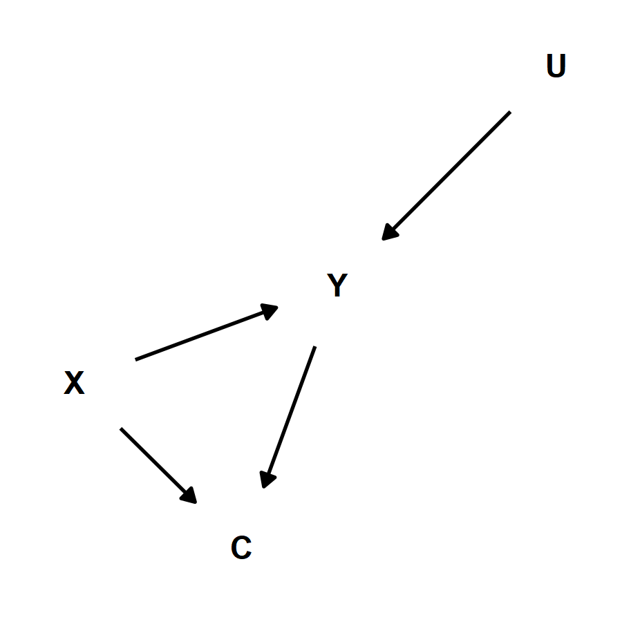

```{r}
rm(list=ls())

library(tidyverse)
library(ggdag)
library(latex2exp)
library(knitr)

# setup libraries
theme_set(theme_minimal())

# functions
constrain <- function(v, minV, maxV) {
  sapply(v, function(y) min(max(y, minV), maxV))
}

se <- function(x) {
  sd(x)/sqrt(length(x))
}

ggplotDag <- function(tidy_ggdag, width=2, height=2) {
  p <- ggdag(tidy_ggdag, text_col="black", node=F) + theme_dag()

  ggsave(p, filename="assets/figure.png", type="cairo", width=width, height=height)
  
  
}
```

## Potential Outcomes

$$
ATE = E[Y_i^1 - Y_i^0]
$$

```{r}
N <- 100000

Y0 <- constrain(rnorm(N, 100, 25), 0, 200)

ggplot() + 
  geom_line(aes(x=Y0), stat="density") + 
  labs(title="Test Score with No Treatment", x=TeX("$Y^0$"))
```

```{r}
Y1 <- Y0 + rnorm(N, 5, 2)

ggplot() + 
  geom_line(aes(x=Y1), stat="density") + 
  geom_line(aes(x=Y0), stat="density", alpha=0.1) + 
  labs(title="Test Score with Treatment", x=TeX("$Y^1$"))
```

```{r}
df <- data.frame(id=1:N, Y0, Y1) %>%
  mutate(TE = Y1 - Y0)

ggplot(df) +
  geom_line(aes(x=TE), stat="density") +
  geom_vline(aes(xintercept=ATE), data=function(df) { summarize(df, ATE=round(mean(TE), 2)) }, color="red") +
  geom_text(aes(x=6, y=0.05, label=ATE), data=function(df) { summarize(df, ATE=round(mean(TE), 4)) }, color="red") +
  labs(title="Test Score Treatment Effect", x=TeX("$Y^1 - Y^0$"))
```


Unfortunately, $Y^0$ and $Y^1$ can never be observed for the same individual. So, we estimate.

$$
\begin{align}
ATE &= E[Y_i^1 - Y_i^0] \\ 
&= E[Y^1] - E[Y^0]
\end{align}
$$

```{r}
df %>%
  summarize(
    AY0 = mean(Y0),
    AY1 = mean(Y1)
    ) %>% 
  mutate(
    ATE = round(AY1 - AY0, 4)
  )
```

$$
E[Y^1|S=1] = E[Y^1] \\
E[Y^0|S=1] = E[Y^0]
$$

```{r}
n <- 200

df <- df %>%
  mutate(R = rnorm(n())) %>%
  arrange(R) %>%
  mutate(S = ifelse(row_number() <= n, 1, 0))

sample <- filter(df, S == 1)

data.frame(
  VAR = c("AY0", "AY1"), 
  POP = c(mean(df$Y0), mean(df$Y1)),
  SMP = c(mean(sample$Y0), mean(sample$Y1)),
  SE = c(se(sample$Y0), se(sample$Y1)),
  TSE = c(sd(df$Y0)/sqrt(n), sd(df$Y1)/sqrt(n)),
  stringsAsFactors = F
) %>%
  mutate(
      CI = paste0("[", round(SMP - 1.96*SE, 4), ", ", round(SMP + 1.96*SE, 4), "]")
  )
```

```{r}
# TIP: students could try and do this first
I <- 1000

sample_means <- sapply(1:I, function(i) { mean(sample_n(df, n, replace=F)$Y1) })

ggplot() + 
  geom_line(aes(x = sample_means), stat="density") +
  annotate("text", 111, 0.13, label=round(sd(sample_means), 3))
```

$$
\begin{align}
ATE &= E[Y^1] - E[Y^0] \\
&= E[Y^1|S=1] - E[Y^0|S=2]
\end{align}
$$

```{r}
df <- df %>%
  mutate(R = rnorm(n())) %>%
  arrange(R) %>%
  mutate(S = ifelse(row_number() <= n, 1, ifelse(row_number() <= n*2, 2, 0)))

sample_1 <- filter(df, S == 1)
sample_2 <- filter(df, S == 2)

t.test(sample_1$Y1, sample_2$Y0, paired=T, var.equal=T)

rbind(data.frame(Y=sample_1$Y1, D=1), data.frame(Y=sample_2$Y0, D=0)) %>%
  lm(Y ~ D, data=.) %>% summary
```

$$
ATE = E[Y_i^1 - Y_i^0] = E[Y^1] - E[Y^0] = E[Y^1|D=1] - E[Y^0|D=0]
$$

```{r}
df <- df %>%
  mutate(R = rnorm(n())) %>%
  arrange(R) %>%
  mutate(S = ifelse(row_number() <= n*2, 1, 0))

sample_RCT <- filter(df, S == 1) %>%
  mutate(
    D = ifelse(row_number() <= n, 1, 0),
    Y = ifelse(D == 1, Y1, Y0)
    )

t.test(sample_RCT[which(sample_RCT$D == 1), "Y"], sample_RCT[which(sample_RCT$D == 0), "Y"], paired=T, var.equal=T)

sample_RCT %>%
  lm(Y ~ D, data=.) %>% summary
```

## Causal Graphs

```{r}
tidy_ggdag <- dagify(
    Y~X
  ) %>% tidy_dagitty(layout="circle")

ggplotDag(tidy_ggdag, 1.5, 1.5)
```

```{r}
tidy_ggdag <- dagify(
    Y~X+U1,
    X~U2
  ) %>% tidy_dagitty(layout="circle")

ggplotDag(tidy_ggdag, 2, 2)
```

$$
Y = f_Y(X, U_1) = \beta X + f_{\alpha,\varepsilon}(U_1) = \alpha + \beta X + \varepsilon \\
E(Y|X) = \left\{
\begin{array}{ll}
\alpha + \beta & X = 1 \\
\alpha & X = 0
\end{array} 
\right. \\ \space \\
\therefore \\ \space \\
ATE = E(Y|X=1) - E(Y|X=0) = \beta
$$


```{r}
tidy_ggdag <- dagify(
    Y~X+C,
    X~C
  ) %>% tidy_dagitty(layout="circle")

ggplotDag(tidy_ggdag, 2, 2)
```

```{r}
tidy_ggdag <- dagify(
    Y~X+C+U,
    X~C
  ) %>% tidy_dagitty(layout="nicely")

ggplotDag(tidy_ggdag, 3, 3)
```

```{r}
C <- 10 + rnorm(N, 0, 10)
X <- as.integer((C + rnorm(N, 0, 30)) > 10)

Y <- 5 + 10*X + C + rnorm(N, 0, 20)

df_2 <- data.frame(Y, X, C)
```


$$
Y = f_Y(X, C, U) = \beta' X + f_{\alpha,\varepsilon}(C, U) = \alpha + \beta' X + \varepsilon \\
X \sim \varepsilon \space\space \therefore \space\space \beta' = \beta + \text{bias}
$$

```{r}
lm(Y ~ X, data=df_2) %>% summary
```

$$
Y = f_Y(X, C, U) = \beta X + \gamma C + f_{\alpha,\varepsilon}(U) = \alpha + \beta X + \gamma C + \varepsilon
$$

```{r}
lm(Y ~ X + C, data=df_2) %>% summary
```

$$
Y = f_Y(X, C, U) = \beta X + f_{\alpha,\varepsilon}(C, U) = \alpha + \beta X + \varepsilon \\
E(Y|do(X=x_0)) = \left\{
\begin{array}{ll}
\alpha + \beta & x_0 = 1 \\
\alpha & x_0 = 0
\end{array} 
\right. \\ \space \\
\therefore \\ \space \\
ATE = E(Y|do(X=1)) - E(Y|do(X=0)) = \beta
$$

```{r}
tidy_ggdag <- dagify(
    Y~X+C+U,
    X~x0
  ) %>% tidy_dagitty(layout="nicely")

ggplotDag(tidy_ggdag, 3, 3)
```

```{r}
C <- 10 + rnorm(N, 0, 10)
X <- 1 #as.integer(rnorm(N) < 0.5)

Y <- 5 + 10*X + C + rnorm(N, 0, 20)

df_3 <- data.frame(Y, X, C)
```

```{r}
lm(Y ~ X, data=df_3) %>% summary
```


